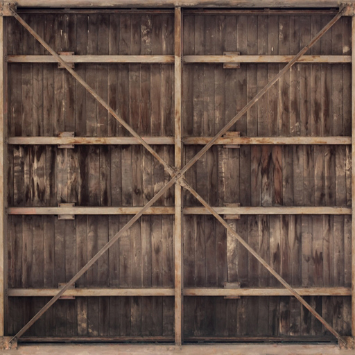

# Texture
TextureはUV座標で管理される

このようにUV座標では左下が(0,0)、右上が(1,1)に対応する。
画像はピクセルごとに色が決まっている。それに対して、UV座標は連続的である。
そのため、あるUV座標 (x,y)はあるピクセルのどこかに位置する。
ではどのように (x,y) 頂点の色を決めるか。

## Filtering
画像はピクセルごとに色が決まっている。それに対して、UV座標は連続的である。
そのため、あるUV座標 (x,y)はあるピクセルのどこかに位置する。
ではどのように (x,y) 頂点の色を決めるか。1つは**最近傍補完** (nearest neighor)、
もう1つは**線形補完** (liner interpolation) である。
* nearest neighorでは、(x,y) 上のピクセルの色をそのまま適用する
* liner interpolationでは (x,y) 周りのピクセルから距離との割合で色を決定する

GL_NEAREST_


GL_LINER


### Mipmaps
オブジェクトが沢山あり、遠くのものと近くのものがあるとする。今のままでは、遠くのものと近くのものが
同じ解像度 (例えば 512x512) のテクスチャを適用する。遠くの物を高解像度のテクスチャで表現しようとすると、
多数のピクセルから、広い範囲を代表する1色を選ぶ必要がある。その結果、小さなオブジェクトにはアーティファクト
　(不自然な表示) が発生するだけでなく、メモリ帯域の無駄にもなる。この問題を解決するために**ミップマップ** 
(mipmaps) がある。オブジェクトから一定以上離れたオブジェクトに対しては、最も適したサイズのミップマップ画像
を使う。オブジェクトが遠ければ、低解像度のテクスチャをつかう。  
ミップマップを切り替える際、OpenGLではミップマップの境界が目立つようなアーティファクトが表示されることがある。
これは、異なるミップマップ間での補完が行われていない際に発生する。

##### `GL_NEAREST_MIPMAP_NEAREST`
ピクセルサイズに最も近いミップマップレベルを1つ選び、そのレベルから最近傍補完で色を取る
* 最も早い
* ちらつきやギザギザ間が出やすい
* 影やリアルタイム描画などの高速描写に向く

##### `GL_LINER_MIPMAP_NEAREST`
最も近い1つのミップマップレベルを選び、そのレベルの中で、線形補完で色を取る
* なめらかさがでる
* ミップマップ間の境界が目立つことがある

##### `GL_NEAREST_MIPMAP_LINER`
ピクセルサイズに合いそうな2つのミップマップレベルを選ぶ。その間を線形補完して中間レベルの値を出す。
各レベルでは最近棒補完で色を取る
* ミップマップ間のつなぎ目は滑らか
* テクセル (テクスチャのピクセル) の精度はやや粗い

##### `GL_LINER_MIPMAP_LINER`
2つのミップマップレベルを選び、各レベルで線形補完を行る。その結果を更に線形補完して滑らかにする
* 最も滑らかで高品質
* 処理コストが高い

```cpp
glTexParameteri(GL_TEXTURE_2D, GL_TEXTURE_MIN_FILTER, GL_LINEAR_MIPMAP_LINEAR);
glTexParameteri(GL_TEXTURE_2D, GL_TEXTURE_MAG_FILTER, GL_LINEAR);
```

### Loading and Creating textures
様々なフォーマットの画像ファイルを独自でロードするのは大変。そこでstd_image.hを使う。
```cpp
#define STB_IMAGE_IMPLEMENTATION
#include "stb_image.h"
```

画像のロードには`std_load()`を使う
```cpp
int width, height, nrChannels;
unsigned char *data = stbi_load("container.jpg", &width, &height, &nrChannels, 0); 
```
では実際にtextureを作る
```cpp
unsigned int texture;
glGenTextures(1, &texture);  
```
TextureのIDを`texture`に保存する

```cpp
glBindTexture(GL_TEXTURE_2D,texture);
```
で生成されたIDをバインドしてアクティブにする
```cpp
glTexImage2D(GL_TEXTURE_2D, 0, GL_RGB, width, height, 0, GL_RGB, GL_UNSIGNED_BYTE, data);
glGenerateMipmap(GL_TEXTURE_2D);
```
* 第1引数では`GL_TEXTURE_2D`を指定すると、現在バインドされている2Dテクスチャオブジェクトに
対して操作が行われる
* 第2引数ではミップマップレベルを指定する。今回は基本レベルの0
* 第3引数では、OpenGLにテクスチャをどのフォーマットで保存するかを伝える。今回はRGB値のみ持ってい
るため、テクスチャもRGBで保存する
* 第4、５引数では高さと幅を設定する
* 第6引数は0にする
* 第7，8引数は元の画像データのフォーマットとデータ方を指定する。今回は画像をRGBフォーマットで読み込み、
char型で保持しているため、それぞれに対応する値を渡す




次のように実装できる
```cpp
#define STB_IMAGE_IMPLEMENTATION

#include"std_image.h"
#include <glad/glad.h>
#include <GLFW/glfw3.h>
#include <iostream>
#include "shader.h"
#include "Common.h"
#include "rectangle.h"
#include "triangle.h"
#include <filesystem>


int main() {
	// GLFW初期化
	glfwInit();

	// Window作成
	glfwWindowHint(GLFW_CONTEXT_VERSION_MAJOR, 3);
	glfwWindowHint(GLFW_CONTEXT_VERSION_MINOR, 3);
	glfwWindowHint(GLFW_OPENGL_PROFILE, GLFW_OPENGL_CORE_PROFILE);

	GLFWwindow* window = glfwCreateWindow(800, 600, "LeranOpenGL", NULL, NULL);
	if (window == NULL) {
		std::cout << "Failed to create GLFW window" << std::endl;
		glfwTerminate();
		return -1;
	}
	glfwMakeContextCurrent(window); //windowを現在のスレッドで使えるようにする
	glfwSetFramebufferSizeCallback(window, framebuffer_size_callback); //callbackを登録
	// ウィンドウがリサイズされたら自動でcallbackが呼ばれる

	// GLADの初期化
	if (!gladLoadGLLoader((GLADloadproc)glfwGetProcAddress)) {
		std::cout << "Failed to initialize GLAD" << std::endl;
		return -1;
	}

	float vertices[] = {
		 0.25f, -0.5f, 0.0f, 1.0f,0.0f,1.0f,// left  
		 0.75f, -0.5f, 0.0f, 0.0f,1.0f,0.0f,// right 
		 0.5f,  0.0f, 0.0f,  0.0f,0.0f,1.0f,// top 
	};

	float vertices_rectangle[] = {
		// position            // color
		-0.5f, -0.5f, 0.0f,    1.0f, 0.0f, 0.0f,  // 0: left bottom
		-0.5f,  0.5f, 0.0f,    0.0f, 1.0f, 0.0f,  // 1: left top
		 0.5f, -0.5f, 0.0f,    0.0f, 0.0f, 1.0f,  // 2: right bottom
		 0.5f,  0.5f, 0.0f,    0.0f, 0.0f, 0.0f   // 3: right top
	};
	unsigned int indices_rectangle[] = {
		0, 1, 2,
		2, 1, 3
	};


	// Shader作成
	Shader mShader_texture("vertex_texture.glsl", "fragment_texture.glsl");


	// Texture
	float vertices_texture[] = {
		// positions          // colors           // texture coords
		 0.5f,  0.5f, 0.0f,   1.0f, 0.0f, 0.0f,   1.0f, 1.0f,   // top right
		 0.5f, -0.5f, 0.0f,   0.0f, 1.0f, 0.0f,   1.0f, 0.0f,   // bottom right
		-0.5f, -0.5f, 0.0f,   0.0f, 0.0f, 1.0f,   0.0f, 0.0f,   // bottom left
		-0.5f,  0.5f, 0.0f,   1.0f, 1.0f, 0.0f,   0.0f, 1.0f    // top left 
	};
	unsigned int indices_texture[] = {
		0,1,3,
		1,2,3
	};

	unsigned int VBO, VAO, EBO;
	glGenVertexArrays(1, &VAO);
	glGenBuffers(1, &VBO);
	glGenBuffers(1, &EBO);

	glBindVertexArray(VAO);

	glBindBuffer(GL_ARRAY_BUFFER, VBO);
	glBufferData(GL_ARRAY_BUFFER, sizeof(vertices_texture), vertices_texture, GL_STATIC_DRAW);

	glBindBuffer(GL_ELEMENT_ARRAY_BUFFER, EBO);
	glBufferData(GL_ELEMENT_ARRAY_BUFFER, sizeof(indices_texture), indices_texture, GL_STATIC_DRAW);

	glVertexAttribPointer(0, 3, GL_FLOAT, GL_FALSE, 8 * sizeof(float), (void*)0);
	glEnableVertexAttribArray(0);

	glVertexAttribPointer(1, 3, GL_FLOAT, GL_FALSE, 8 * sizeof(float), (void*)(3 * sizeof(float)));
	glEnableVertexAttribArray(1);

	glVertexAttribPointer(2, 2, GL_FLOAT, GL_FALSE, 8 * sizeof(float), (void*)(6 * sizeof(float)));
	glEnableVertexAttribArray(2);


	unsigned int texture1,texture2;
	// texture1 
	{
		glGenTextures(1, &texture1); // 生成されたIDをtexutreに格納
		glBindTexture(GL_TEXTURE_2D, texture1);

		// set the texture wrapping/filtering options
		glTexParameteri(GL_TEXTURE_2D, GL_TEXTURE_WRAP_S, GL_REPEAT);
		glTexParameteri(GL_TEXTURE_2D, GL_TEXTURE_WRAP_T, GL_REPEAT);
		glTexParameteri(GL_TEXTURE_2D, GL_TEXTURE_MIN_FILTER, GL_LINEAR_MIPMAP_LINEAR);
		glTexParameteri(GL_TEXTURE_2D, GL_TEXTURE_MAG_FILTER, GL_LINEAR);

		// Load Texture
		int width, height, nrChannels;
		unsigned char* data = stbi_load("Assets/container.jpg", &width, &height, &nrChannels, 0);

		// Texture作成
		if (data) {
			glTexImage2D(GL_TEXTURE_2D, 0, GL_RGB, width, height, 0, GL_RGB, GL_UNSIGNED_BYTE, data);
			glGenerateMipmap(GL_TEXTURE_2D);
		}
		else {
			std::cout << "Failed to load texture" << std::endl;
		}

		stbi_image_free(data);
	}

	// texture2
	{
		glGenTextures(1, &texture2);
		glBindTexture(GL_TEXTURE_2D, texture2);

		glTexParameteri(GL_TEXTURE_2D, GL_TEXTURE_WRAP_S, GL_REPEAT);
		glTexParameteri(GL_TEXTURE_2D, GL_TEXTURE_WRAP_T, GL_REPEAT);
		glTexParameteri(GL_TEXTURE_2D, GL_TEXTURE_MIN_FILTER, GL_LINEAR_MIPMAP_LINEAR);
		glTexParameteri(GL_TEXTURE_2D, GL_TEXTURE_MAG_FILTER, GL_LINEAR);

		int width, height, nrChannels;
		stbi_set_flip_vertically_on_load(true); // 上下反転を解消
		unsigned char* data = stbi_load("Assets/awesome_face.jpg", &width, &height, &nrChannels, 0);

		if (data) {
			glTexImage2D(GL_TEXTURE_2D, 0, GL_RGB, width, height, 0, GL_RGB, GL_UNSIGNED_BYTE, data);
			glGenerateMipmap(GL_TEXTURE_2D);
		}
		else {
			std::cout << "Failed to load texture" << std::endl;
		}

		stbi_image_free(data);
	}

	// uniform
	mShader_texture.use();
	mShader_texture.setInt("texture1", 0);
	mShader_texture.setInt("texture2", 1);


	while (!glfwWindowShouldClose(window)) {
		processInput(window);

		glClearColor(0.2f, 0.3f, 0.3f, 1.0f);
		glClear(GL_COLOR_BUFFER_BIT);


		// Texture
		mShader_texture.use();
		glActiveTexture(GL_TEXTURE0);
		glBindTexture(GL_TEXTURE_2D, texture1);
		glActiveTexture(GL_TEXTURE1);
		glBindTexture(GL_TEXTURE_2D, texture2);
		glBindVertexArray(VAO);
		glDrawElements(GL_TRIANGLES, 6, GL_UNSIGNED_INT, 0);

		glfwSwapBuffers(window);
		glfwPollEvents();

	}

	glfwTerminate();
	return 0;
}
```


